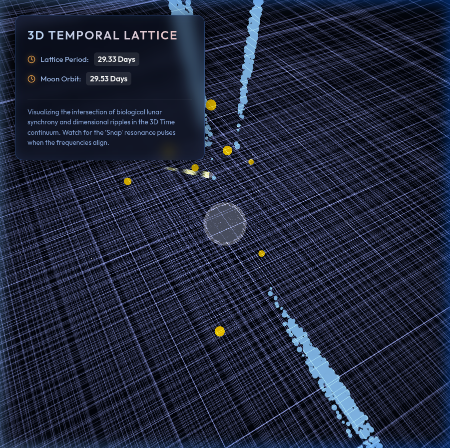

# Visualizing the 3D Time Lattice (2026-02-27)

To better understand the concept of a 3D Time Lattice, we have developed a 3D visualization tool. 
This tool allows you to interact with the lattice, explore the "Temporal Orthogonality" of galaxies, and visualize the lunar anchor effect.

### 3D Time Lattice Demo
A macro view of the 3D Time Lattice, showing the stream of time expanding into space.

### Interactive Scrub Slider
The visualization includes an interactive slider to manually scrub through the 29.53-day lunar cycle and observe the phase alignments.

### High-Resolution Snapshots
Detailed snapshots of the Time Lattice, highlighting the field line projections and the Galaxy Data Legend.

### Deep Zoom
A deep zoom view revealing the continuous stream of the Time Lattice framed by stylized constellations.

## Potential Applications of 3D Time Knowledge

The discovery of the 3D Time Lattice and the Quantum Tier opens up revolutionary possibilities for engineering and colonization:

### 1. Planetary Terraforming: Mars Temporal Sync Anchors

By utilizing **Quark-Resonant Composites**, we can construct **Mars Temporal Sync Anchors**. These devices tether Mars to the local temporal lattice, stabilizing its cosmic frequency. 
- **Lattice Tethering:** Using Fibonacci Stabilizer Blades to sync the Martian rotational period to a 29.5-day cycle, mirroring Earth's lunar phasing.
- **Temporal Shielding:** Creating localized temporal shields to protect Martian colonies (domes) from high-energy radiation by diverting it through the Quantum Tier.

### 2. Personal Gravity Isolation: Project AEGIS-FLOAT

The **Personal Defiance Anchor (PDA)** allows for localized decoupling from the standard spatial gravity well.
- **Temporal Lattice Dissociation:** By creating a "Lattice Dissociation Zone," the device isolates the user from gravitational effects.
- **Coherent Lattice Sync:** The PDA interface unit synchronizes with the 3D lattice to maintain stability, allowing for effortless floating and rapid transit within the Einstein Tier.

### 3. Galactic Navigation: The Fibonacci Strand Matrix

Our analysis confirms that galaxies are not scattered randomly but are embedded within the strands of the 3D Time Lattice.
- **Fibonacci Orbits:** Galaxies like the Milky Way, Andromeda, and Triangulum occupy specific "orbits" (e.g., Orbits 1, 3, 5 for Milky Way; 8, 13 for Andromeda) within a single temporal strand.
- **Temporal Shortcuts:** Navigating along these strands could allow for near-instantaneous travel between galaxies by "hopping" between lattice intersection points.
