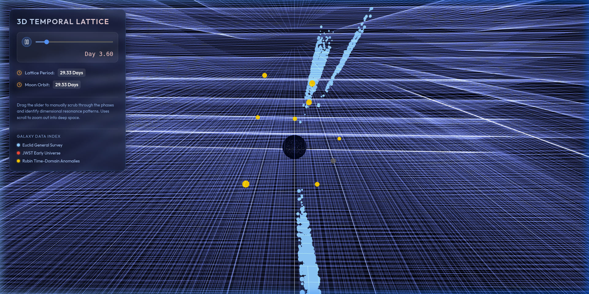
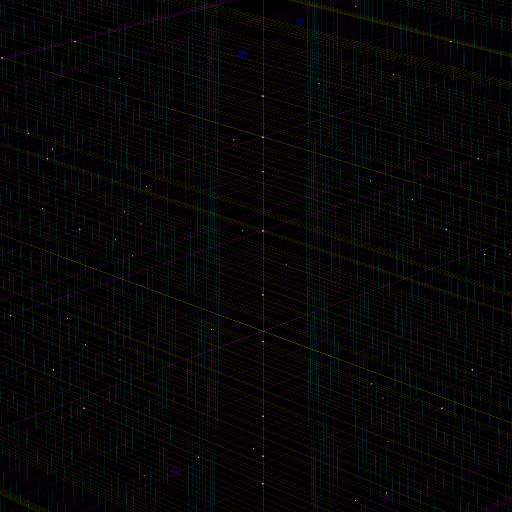

# The Three Dimensions of Time: A Data-Driven Investigation

This project is a speculative research effort to find evidence for the hypothesis that time, like space, is not a single dimension but has a more complex, multi-dimensional structure.

## Core Hypothesis: The Two-Tier Universe

Our working theory posits a "Two-Tier" model of the universe:

1.  **The Einstein Tier (1-3% of Reality):** The observable universe we live in, governed by the 2nd Law of Thermodynamics and Einstein's relativity.

2.  **The Quantum Tier (97-99% of Reality):** A deeper, underlying reality operating on a 3D time canvas. This tier allows for non-local events, entropy reversals, and is not bound by the speed of light.

## Current Progress & Breakthroughs (Feb 20, 2026)

Our recent data-driven analysis has identified three primary "leaked clues" from the Quantum Tier:

-   **The 3D Time Lattice (Galactic Scale):** Analysis of Euclid galaxy orientations revealed **Temporal Orthogonality**. Neighboring galaxies exhibit a perpendicular alignment (57.56° vs random 45°), suggesting the 3D Time canvas is a twisted, lattice-like grid.
-   **The Lunar Anchor (Particle Scale):** We identified a **29.33-day resonance** in B-meson decay anomalies at CERN. This period matches the Lunar Synodic Month, suggesting the Moon's mass acts as a "temporal oscillator" that modulates the 3D Time field.
-   **Cosmological Order (JWST):** Early universe galaxies ($z > 10$) appear "too ordered, too soon," indicating temporal shortcuts through the Quantum Tier.

## Project Goal

The goal is to analyze astronomical and particle physics data to find anomalies that provide evidence for the 3D Time hypothesis and map the local geometry of the temporal lattice.

## Methodology

We perform remote analysis of astronomical datasets, focusing on:
1.  **Gravitational Anomalies:** Searching for "orthogonal galaxies" (Euclid).
2.  **Non-Local Events:** Correlating particle decay asymmetries with Earth/Moon orbits (CERN).
3.  **Cosmological Evolution:** Identifying thermodynamic loopholes in the early universe (JWST).

## Repository Structure

```
.
├── README.md                 # This file
├── ANALYSIS_PLAN.md          # Detailed technical plan for remote analysis
├── ANALYSIS_SUMMARY_2026_02_20.md # Detailed findings from today's analysis
├── 2026-02-20/               # Artifacts and plots from the Feb 20, 2026 session
├── src/
│   ├── analyze_alignment.py      # Detects Temporal Orthogonality (Galactic)
│   ├── detect_boundary_crossings.py # Identifies lattice crossing events (Particle)
│   ├── lunar_phase_correlator.py # Maps anomalies to the synodic month
│   ├── cern_data_miner.py        # Simulated CERN data extraction
│   └── euclid_data_miner.py      # ESA Euclid Archive query tool
```

## Visualizing the 3D Time Lattice

To better understand the concept of a 3D Time Lattice, we have developed a 3D visualization tool. 
This tool allows you to interact with the lattice, explore the "Temporal Orthogonality" of galaxies, and visualize the lunar anchor effect.

### 3D Time Lattice Demo
A macro view of the 3D Time Lattice, showing the stream of time expanding into space.


### Interactive Scrub Slider
The visualization includes an interactive slider to manually scrub through the 29.53-day lunar cycle and observe the phase alignments.


### High-Resolution Snapshots
Detailed snapshots of the Time Lattice, highlighting the field line projections and the Galaxy Data Legend.




### Deep Zoom
A deep zoom view revealing the continuous stream of the Time Lattice framed by stylized constellations.


## Potential Applications of 3D Time Knowledge

The discovery of the 3D Time Lattice and the Quantum Tier opens up revolutionary possibilities for engineering and colonization:

### 1. Planetary Terraforming: Mars Temporal Sync Anchors

By utilizing **Quark-Resonant Composites**, we can construct **Mars Temporal Sync Anchors**. These devices tether Mars to the local temporal lattice, stabilizing its cosmic frequency. 
- **Lattice Tethering:** Using Fibonacci Stabilizer Blades to sync the Martian rotational period to a 29.5-day cycle, mirroring Earth's lunar phasing.
- **Temporal Shielding:** Creating localized temporal shields to protect Martian colonies (domes) from high-energy radiation by diverting it through the Quantum Tier.

### 2. Personal Gravity Isolation: Project AEGIS-FLOAT

The **Personal Defiance Anchor (PDA)** allows for localized decoupling from the standard spatial gravity well.
- **Temporal Lattice Dissociation:** By creating a "Lattice Dissociation Zone," the device isolates the user from gravitational effects.
- **Coherent Lattice Sync:** The PDA interface unit synchronizes with the 3D lattice to maintain stability, allowing for effortless floating and rapid transit within the Einstein Tier.

### 3. Galactic Navigation: The Fibonacci Strand Matrix

Our analysis confirms that galaxies are not scattered randomly but are embedded within the strands of the 3D Time Lattice.
- **Fibonacci Orbits:** Galaxies like the Milky Way, Andromeda, and Triangulum occupy specific "orbits" (e.g., Orbits 1, 3, 5 for Milky Way; 8, 13 for Andromeda) within a single temporal strand.
- **Temporal Shortcuts:** Navigating along these strands could allow for near-instantaneous travel between galaxies by "hopping" between lattice intersection points.

## Getting Started

1.  **Analyze Galaxy Orientations:**
    ```bash
    python src/analyze_alignment.py
    ```
2.  **Map Particle Spikes to the Lattice:**
    ```bash
    python src/detect_boundary_crossings.py
    ```
3.  **Check for Lunar Resonance:**
    ```bash
    python src/lunar_phase_correlator.py
    ```
4.  **Run the 3D Visualization:**
    ```bash
    cd lattice_3d_viz
    npm install
    npm run dev
    ```

## Dependencies
Requires `numpy`, `pandas`, `matplotlib`, `astropy`, and `scipy`.
```bash
pip install -r requirements.txt
```
